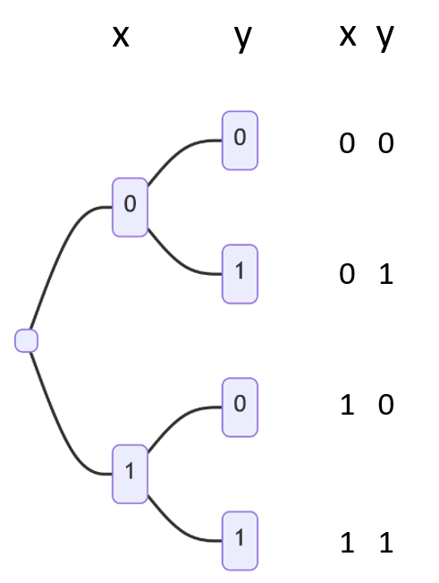
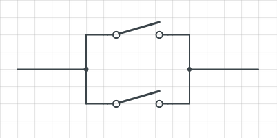
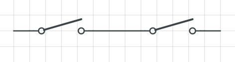
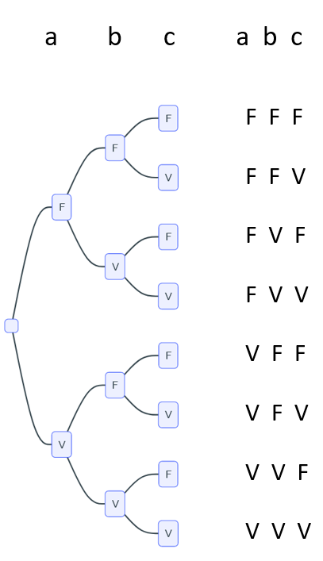
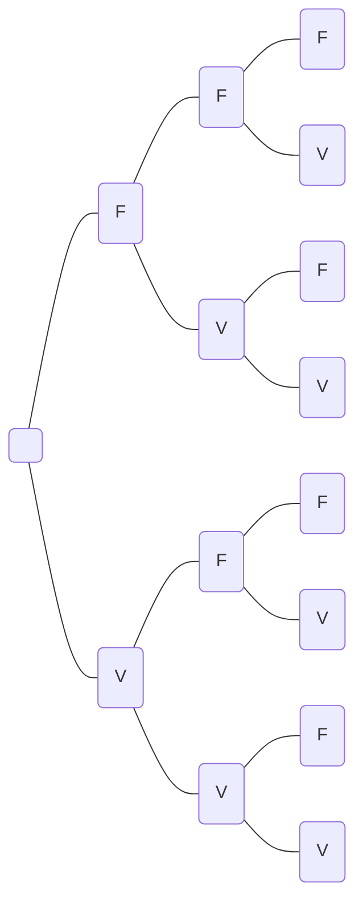

# Le type booléen

{ width=20%; align=right }

En 1847, George Boole invente une algèbre pour formaliser la logique.
Il définit trois opérateurs de base, qui vont permettre de traiter tous
les problèmes de logique.

Crédit : Public domain, via Wikimedia Commons.


## I. Exemples de propositions et opérateurs de bases

!!! example "Exemple"

	a : Au self, il y a des frites tous les jours  
	b : Il est interdit de fumer dans le lycée  


!!! info "Une proposition peut être vraie ou fausse"

	Vrai : True ou 1  
	Faux : False ou 0

???+ question "Donner la valeur de vérité des propositions a et b"

	a : Au self, il y a des frites tous les jours  
	b : Il est interdit de fumer dans le lycée 

    ??? success "Solution"

        a est une proposition **fausse** (False ou 0)  
        b est une proposition **vraie** (True ou 1)


???+ question "Opérateur **ou**"

	a : Au self, il y a des frites tous les jours   
	b : Il est interdit de fumer dans le lycée  
	a ou b est une proposition ...

	!!! info "Notations"

		On peut noter a or b, ou a $\vee$ b (correspond au symbole $\cup$)

    ??? success "Solution"

        a ou b est une proposition **vraie** (True ou 1)


???+ question "Opérateur **et**"

	a : Au self, il y a des frites tous les jours   
	b : Il est interdit de fumer dans le lycée   
	a et b est une proposition ...

	!!! info "Notations"

		On peut noter a and b, ou a $\wedge$ b (correspond au symbole $\cap$)

    ??? success "Solution"

        a et b est une proposition **fausse** (False ou 0)


???+ question "Opérateur **non**"

	a : Au self, il y a des frites tous les jours   
	b : Il est interdit de fumer dans le lycée  
	non a : ...   
	non b : ... 

	!!! info "Notations"

		On peut noter not a ou  $\neg$a

    ??? success "Solution"

        non a : Il existe au moins un jour sans frites au self  
        non b : Il est permis de fumer au lycée  
        non a est une proposition vraie   
        non b est une proposition fausse


{ width=40%; : .center }

Crédit : Philippe Geluck 

## II. Tables de vérités

???+ question "On jette deux dés"

	Des propositions peuvent être vraies ou fausses.  
	Par exemple : on jette deux dés.    
	x : le résultat du premier dé est pair  
	y : le résultat du deuxième dé est pair  

	Dessiner sur votre cahier l'arbre de toutes les possibilités.

    ??? success "Solution"

    	{ width=30% }

    	<!---
    	```mermaid
		graph LR
		A( )
		B(0)
		C(1)
		D(0)
		E(1)
		F(0)
		G(1)
		A --- B
		A --- C
		B --- D
		B --- E
		C --- F
		C --- G
		```
		-->

!!! info "Présentation des tables de vérités"

    La présentation usuelle reprend l'ordre trouvé avec l'arbre ci-dessus :

    * Pour une seule proposition x:

    |x| ... | 
    |:--:|:--:|
    |0|...|
    |1|...|

    * Pour deux propositions x et y

    |x|y| ... | 
    |:--:|:--:|:--:|
    |0|0|...|
    |0|1|...|
    |1|0|...|
    |1|1|...|

???+ question "Table de vérité de l'opérateur non"

	Compléter la table de vérité

	|$x$| $\overline{x}$ | 
    |:--:|:--:|
    |0|...|
    |1|...|

    ??? success "Solution"

    	|$x$| $\overline{x}$ | 
    	|:--:|:--:|
    	|0|1|
    	|1|0|

???+ question "Table de vérité de l'opérateur ou"

	Compléter la table de vérité

    |x|y| x $\vee$  y| 
    |:--:|:--:|:--:|
    |0|0|...|
    |0|1|...|
    |1|0|...|
    |1|1|...|

    ??? success "Solution"

		|x|y| x $\vee$  y| 
    	|:--:|:--:|:--:|
    	|0|0|0|
    	|0|1|1|
    	|1|0|1|
    	|1|1|1|

    { width=30%; : .center }

	On peut faire l'analogie avec des interrupteurs en parallèle.


???+ question "Table de vérité de l'opérateur et"

	Compléter la table de vérité

    |x|y| x $\wedge$  y| 
    |:--:|:--:|:--:|
    |0|0|...|
    |0|1|...|
    |1|0|...|
    |1|1|...|

    ??? success "Solution"

		|x|y| x $\wedge$   y| 
    	|:--:|:--:|:--:|
    	|0|0|0|
    	|0|1|0|
    	|1|0|0|
    	|1|1|1|

    { width=30%; : .center }

    On peut faire l'analogie avec des interrupteurs en série.

!!! warning "Remarque"

    On peut écrire toutes les tables de vérités en remplaçant les 0 par des F (pour Faux), et les 1 par des V (pour Vrai)


## III. Exemples d’expressions booléennes :

### 1. non (a et b)

???+ question "non (a et b)"

	Démontrer en utilisant des tables de vérité que les expressions booléennes suivantes sont équivalentes :

	* not (a and b)
	* not a or not b

	Pour cela recopier et remplir les tables de vérités suivantes :

	|a|b| a et b| non (a et b)|
    |:--:|:--:|:--:|:--:|
    |...|...|...|...|
    |...|...|...|...|
    |...|...|...|...|
    |...|...|...|...|

    |a|b| non a| non b|(non a) or (nonb)|
    |:--:|:--:|:--:|:--:|:--:|
    |...|...|...|...|...|
    |...|...|...|...|...|
    |...|...|...|...|...|
    |...|...|...|...|...|

    ??? success "Solution"

    	|a|b| a et b| non (a et b)|
    	|:--:|:--:|:--:|:--:|
    	|0|0|0|**1**|
    	|0|1|0|**1**|
    	|1|0|0|**1**|
    	|1|1|1|**0**|

    	|a|b| non a| non b|(non a) or (nonb)|
    	|:--:|:--:|:--:|:--:|:--:|
    	|0|0|1|1|**1**|
    	|0|1|1|0|**1**|
    	|1|0|0|1|**1**|
    	|1|1|0|0|**0**|

    	Les dernières colonnes de ces deux tableaux sont identiques, ce qui prouve l'équivalence.

### 2. non (a ou b)

???+ question "non (a ou b)"

	Démontrer en utilisant des tables de vérité que les expressions booléennes suivantes sont équivalentes :

	* not (a or b)
	* not a and not b

	Pour cela recopier et remplir les tables de vérités suivantes :

	|a|b| a ou b| non (a ou b)|
    |:--:|:--:|:--:|:--:|
    |...|...|...|...|
    |...|...|...|...|
    |...|...|...|...|
    |...|...|...|...|

    |a|b| non a| non b|(non a) and (nonb)|
    |:--:|:--:|:--:|:--:|:--:|
    |...|...|...|...|...|
    |...|...|...|...|...|
    |...|...|...|...|...|
    |...|...|...|...|...|

    ??? success "Solution"

    	|a|b| a ou b| non (a ou b)|
    	|:--:|:--:|:--:|:--:|
    	|0|0|0|**1**|
    	|0|1|1|**0**|
    	|1|0|1|**0**|
    	|1|1|1|**0**|

    	|a|b| non a| non b|(non a) et (nonb)|
    	|:--:|:--:|:--:|:--:|:--:|
    	|0|0|1|1|**1**|
    	|0|1|1|0|**0**|
    	|1|0|0|1|**0**|
    	|1|1|0|0|**0**|

    	Les dernières colonnes de ces deux tableaux sont identiques, ce qui prouve l'équivalence.


!!! info "Remarque : ces deux propriétés sont connues sous le nom de lois de De Morgan."

## IV. Un opérateur supplémentaire : xor

???+ question "Fromage ou dessert ?"

	Lorsqu’au restaurant on vous demande « fromage ou dessert ? », quels sont les possibilités auxquelles vous avez le droit ?

	??? success "Solution"

		On peut choisir soit le fromage, soit le dessert, mais pas les deux.

	!!! info "Il s’agit du « ou » exclusif, noté **xor**."

!!! example "Exemple du jardinier"

    Un jardinier doit élaguer tous les arbres qui mesurent plus de 10 mètres ou qui ont plus de 10 ans.
	Peut-il tailler des arbres qui mesurent plus de 10 mètres et ont plus de 10 ans ?

	??? success "Solution"

		Il peut évidemment tailler des arbres qui mesurent plus de 10 mètres et ont plus de 10 ans.

		!!! info "Il s’agit du « ou » inclusif, noté **or**."

???+ question "Table de vérité de l'opérateur xor"

	Recopier et compléter la table de vérité

    |x|y| x xor  y| 
    |:--:|:--:|:--:|
    |...|...|...|
    |...|...|...|
    |...|...|...|
    |...|...|...|

    ??? success "Solution"

		|x|y| x xor  y| 
    	|:--:|:--:|:--:|
    	|0|0|0|
    	|0|1|1|
    	|1|0|1|
    	|1|1|0|

## V. Variables booléennes et Python

### 1. Les variables booléennes

!!! example "Tester en console"

    Dans la console saisir les lignes suivantes, **une par une** en exécutant entre chaque (ne pas copier/coller) :

    ```pycon
    >>> 3 == 5
    >>> 3 == "3"
    >>> 3 < 5
    >>> 3 != 5
    ```

    {{ terminal() }}

!!! example "Des variables booléennes"

	Souvent les variables booléennes sont le résultat de tests :

    Dans la console saisir les lignes suivantes, **une par une** en exécutant entre chaque (ne pas copier/coller) :

    ```pycon
    >>> a = -3**2 == -9
    >>> type(a)
    >>> a
    >>> a = (-3)**2 == -9
    >>> a
    ```

    {{ terminal() }}

### 2. Python et les opérateurs

!!! info "Les booléens en Python"

	En Python, les booléens peuvent prendre les valeurs `True` et `False`.

	Les opérations booléennes de bases sont `and`, `or` et `not`.

!!! example "Tester en console"

    Dans la console saisir :

    ```pycon
    >>> True and False
    >>> True or False
    >>> not True
    ```

    Vous pouvez ajouter vos propres essais 😊.

    {{ terminal() }}

!!! example "Les priorités"

	Comme pour les opérations mathématiques, il y a des priorités sur les opérations booléennes.
    
    Dans la console saisir les lignes suivantes, **une par une** en exécutant entre chaque (ne pas copier/coller) :

    ```pycon
    >>> True or True and False
    >>> (True or True) and False
    >>> True or (True and False)
    ```

    Vous pouvez ajouter vos propres essais 😊.

    {{ terminal() }}

!!! info "Les priorités"

	Le `and` est prioritaire sur le `or`. De même, `not` est prioritaire sur les autres opérations.

!!! example "Tester les priorités"

	Dans la console saisir les lignes suivantes, **une par une** en exécutant entre chaque (ne pas copier/coller) :

    ```pycon
    >>> not False and False
    >>> not (False and False)
    >>> (not False) and False
    ```

    Vous pouvez ajouter vos propres essais 😊.

    {{ terminal() }}

!!! danger "Attention"

    Pour éviter toute confusion, il est vivement recommandé d’utiliser des parenthèses.

### 3. Exemples 

???+ question "Question 1"

	Expliquer pourquoi l’expression 3 == 3 or x == y est vraie pour toute valeur de x et de y.

    ??? success "Solution"

    	3 == 3 est évaluée à True. True or True et True or False sont évaluées à True.

    	Donc quelle que soit la valeur de vérité de x == y l'expression est évaluée à True

???+ question "Question 2"

	Expliquer pourquoi l’expression 1 == 2 and x == y est fausse pour toute valeur de x et de y.

    ??? success "Solution"

    	3 == 2 est évaluée à False. False and True et False and False sont évaluées à False.

    	Donc quelle que soit la valeur de vérité de x == y l'expression est évaluée à False.

## VI. Caractère séquentiel de certains opérateurs booléens.

!!! info "Python paresseux"

	Lorsque Python évalue une expression booléenne, il le fait de façon paresseuse. C’est à dire que si la partie gauche d’un or est vraie, il n’évalue pas la partie droite. De même si la partie gauche d’un and est fausse, la partie droite n’est pas évaluée.

!!! example "Tester les évaluations paresseuses"

	Dans la console saisir :

    ```pycon
    >>> x = 0
    >>> x == 0 or 0 < 1/x < 1
    >>> x !=0 and 0 < 1/x < 1
    ```

    {{ terminal() }}

    !!! failure "Diviser par 0 ?"

    	Si la division 1/x était évaluée, il y aurait une erreur, puisque l’on ne peut pas diviser par 0.
  

    !!! info "Python paresseux"

    	Dans les deux cas, l’évaluation n’est pas faite puisque le résultat de l’expression a déjà pu être déterminé grâce à la partie gauche.

## VII. Exercices

???+ question "Exercice 1"

	Déterminer la table de vérité de : **a ou (non b)**

    ⏳ La correction viendra bientôt ... 

<!--- 
??? success "Solution"
	|a|b| non b| a ou (non b)|
	|:--:|:--:|:--:|:--:|
	|F|F|V|**V**|
	|F|V|F|**F**|
	|V|F|V|**V**|
	|V|V|F|**V**|
-->


???+ question "Exercice 2"

	Déterminer la table de vérité de : **(non a) et b**

	⏳ La correction viendra bientôt ... 

<!--- 
??? success "Solution"
	|a|b| non a| (non a) et b|
	|:--:|:--:|:--:|:--:|
	|F|F|V|**F**|
	|F|V|V|**V**|
	|V|F|F|**F**|
	|V|V|F|**F**|
-->


???+ question "Exercice 3 à utiliser pour les exercices suivants"

	Faire un arbre de toutes les possibilités avec trois propositions a, b et c comme nous l’avons fait en cours pour deux propositions.

	⏳ La correction viendra bientôt ... 


<!--- 
??? success "Solution"

    { width=30% }
-->

<!--- 

-->


???+ question "Exercice 4"

	Déterminer la table de vérité de : **(a ou b) et c**

	⏳ La correction viendra bientôt ... 

<!--- 
??? success "Solution"
	|a|b| c| a ou b| (a ou b) et c|
	|:--:|:--:|:--:|:--:|:--:|
	|F|F|F|F|**F**|
	|F|F|V|F|**F**|
	|F|V|F|V|**F**|
	|F|V|V|V|**V**|
	|V|F|F|V|**F**|
	|V|F|V|V|**V**|
	|V|V|F|V|**F**|
	|V|V|V|V|**V**|

-->


???+ question "Exercice 5"

	Déterminer la table de vérité de : **(a et b) ou c**

	⏳ La correction viendra bientôt ... 

<!--- 
??? success "Solution"
	|a|b| c| a et b| (a et b) ou c|
	|:--:|:--:|:--:|:--:|:--:|
	|F|F|F|F|**F**|
	|F|F|F|F|**V**|
	|F|V|F|F|**F**|
	|F|V|V|F|**V**|
	|V|F|F|F|**F**|
	|V|F|V|F|**V**|
	|V|V|F|V|**V**|
	|V|V|V|V|**V**|

-->


???+ question "Exercice 6"

	Démontrer que a xor b est équivalent à : (a ou b) et (non (a et b))   

	⏳ La correction viendra bientôt ... 

<!---
??? success "Solution"

		|a|b| **a xor  b**| 
    	|:--:|:--:|:--:|
    	|F|F|**F**|
    	|F|V|**V**|
    	|V|F|**V**|
    	|V|V|**F**|

		|a|b| a ou  b| a et b| non (a et b)|**(a ou b) et (non(a et b))**|
    	|:--:|:--:|:--:|:--:|:--:|:--:|
    	|F|F|F|F|V|**F**|
    	|F|V|V|F|V|**V**|
    	|V|F|V|F|V|**V**|
    	|V|V|V|V|F|**F**|

-->


???+ question "Exercice 7"

	⌛  Ne faire cet exercice qu'après avoir terminé l'étude des fonctions en Python.

	
	Ecrire la fonction `et_logique` qui prend en paramètres deux entiers `a` et `b` valant 0 ou 1. Cette fonction renvoie `a` et `b`.

	!!! danger "Contrainte"

		Utiliser exclusivement le « matériel » Python suivant : `def`, `if`, `elif`, `else`, `==`, `return`.


	!!! example "Exemple"

		```pycon
		>>> et_logique(0, 1)
		0
		>>> et_logique(0, 0)
		0
		>>> et_logique(1, 1)
		1
		```


    Compléter le script ci-dessous (observer les affichages de tests):

    {{ IDE('scripts/logique_et') }}

	

???+ question "Exercice 8"

	⌛  Ne faire cet exercice qu'après avoir terminé l'étude des fonctions en Python.

	écrire la fonction `ou_logique` qui prend en paramètres deux entiers `a` et `b` valant 0 ou 1. Cette fonction renvoie `a` ou `b`.

	!!! danger "Contrainte"

		Utiliser exclusivement le « matériel » Python suivant : `def`, `if`, `elif`, `else`, `==`, `return`.

	`a` et `b` sont des variables pouvant prendre les valeurs 0 ou 1.


	!!! example "Exemple"

		```pycon
		>>> ou_logique(0, 1)
		1
		>>> ou_logique(1, 1)
		1
		>>> ou_logique(0, 0)
		0
		```

	Compléter le script ci-dessous (observer les affichages de tests):

    {{ IDE('scripts/logique_ou') }}

	


